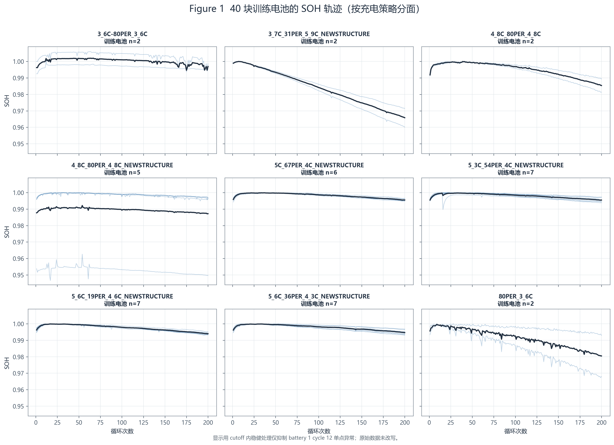
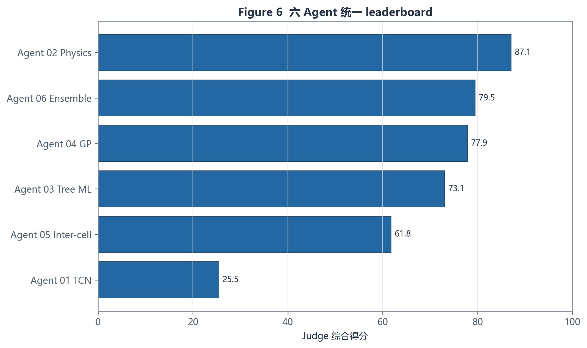
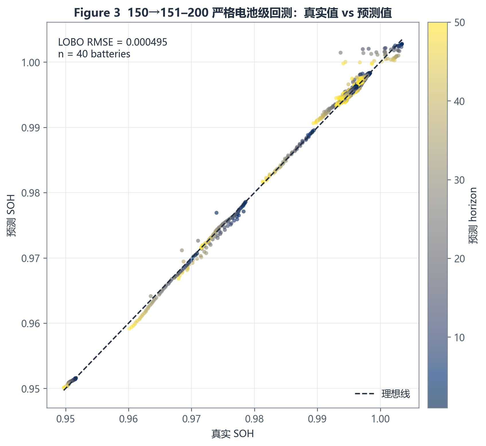
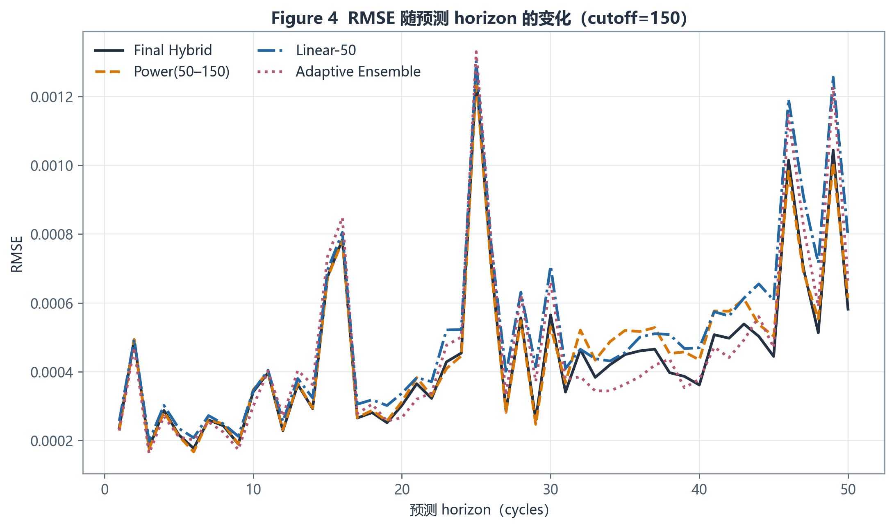
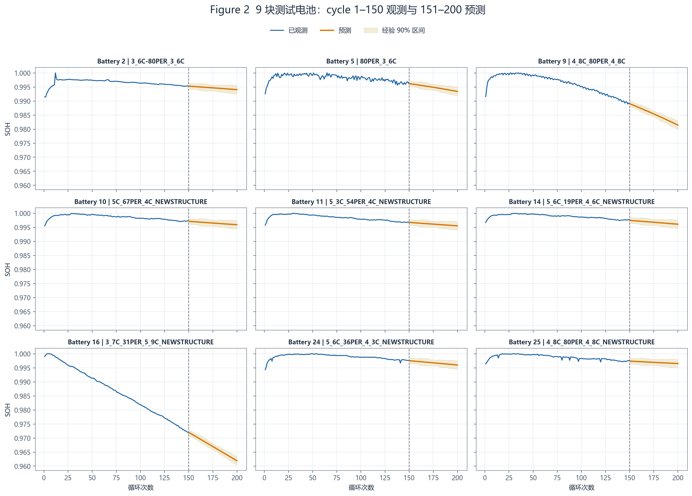
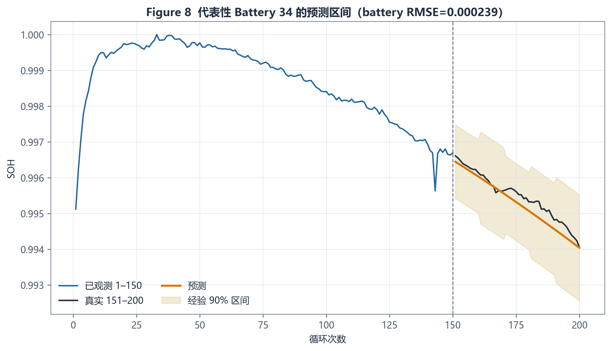
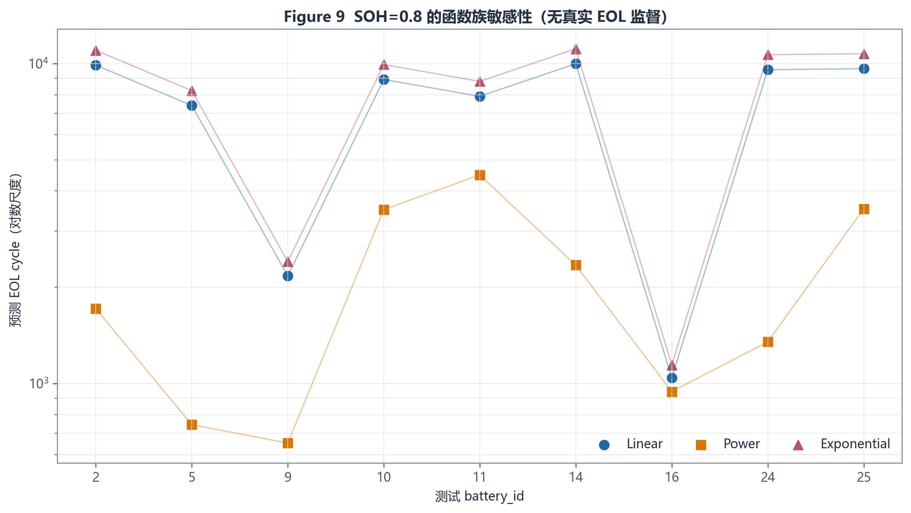
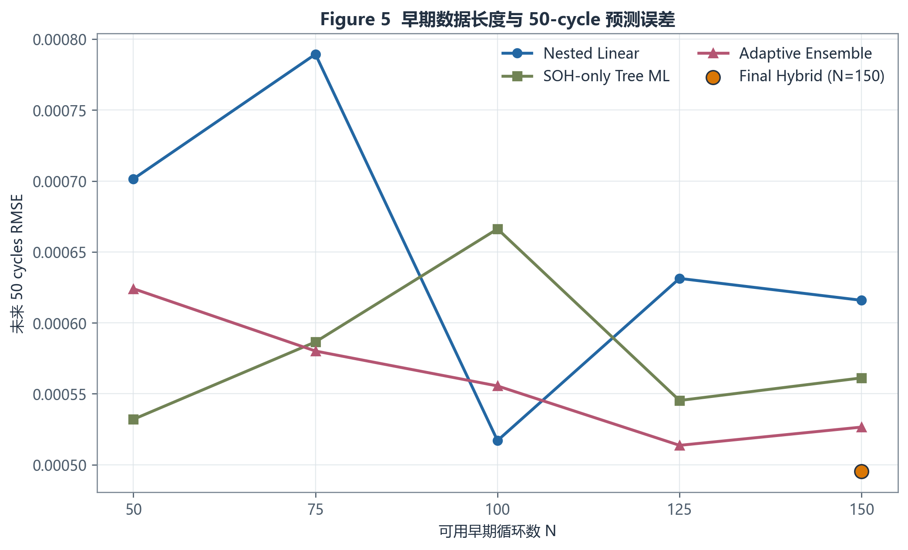
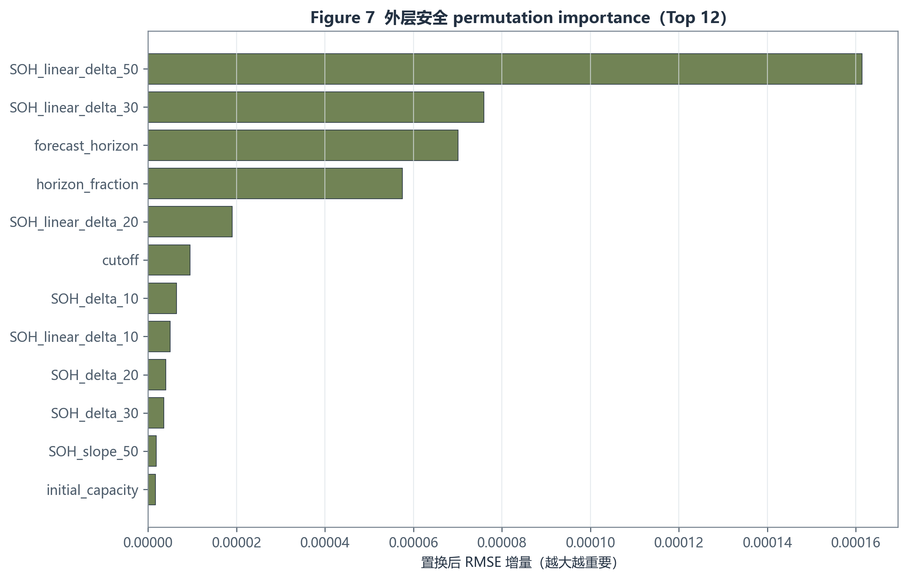
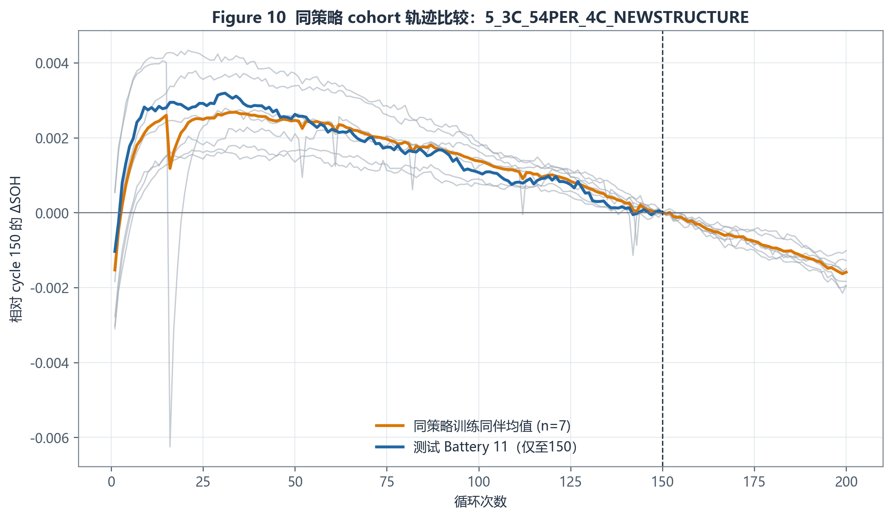

# 3 电池寿命预测模型

## 技术摘要

本题必须分成两个不同的预测问题。对可回测的短期任务，最终采用 **Power(最后 101 cycles) 与 recent-linear-50 的凸组合**；元权重在每个外层电池上只由其余 39 块训练电池学习。核心 `150→151–200` 严格 battery-level 回测得到 RMSE **0.000495**、MAE **0.000271**、mean/median/worst battery RMSE 分别为 **0.000338/0.000234/0.002231**。

对长期 EOL，给定 CSV 中真实 `SOH<=0.8` crossing 是否存在：**False**。因此 EOL 不是普通监督预测，而是 long-horizon extrapolation。本报告分别给出 linear、power、exponential 与四种拟合起点的结果及模型包络；这些上下界表达模型假设敏感性，不是经真实 EOL 校准的置信区间，也不报告 EOL RMSE。

## 3.1 问题分析：短期预测与长期外推必须分离

短期任务定义为

\[
\hat{SOH}_{N+1:N+50}=F\!\left(\mathcal{D}_{1:N},\mathbf{s}\right),\qquad N=150,
\]

其中动态数据 \(\mathcal{D}_{1:N}\) 只含 cutoff 前的 SOH、IR、温度与充电时间，静态策略 \(\mathbf{s}=(C_1,Q_1,C_2)\)。该任务可用 40 块训练电池在 `50/75/100/125/150 → +50 cycles` 做真实回测。

长期任务为

\[
n_{\mathrm{EOL}}=\min\{n:SOH(n)\le 0.8\}.
\]

由于 9,350 行赛题循环数据中没有 0.8 crossing，把短期模型无限递推到 0.8 会把局部趋势误当长期退化机制。因此 Stage I 只负责 151–200，Stage II 使用半经验函数族并显式报告外推分歧。

## 3.2 数据与健康特征构造

共有 49 块电池、9 种 policy，其中 40 块训练电池完整覆盖 cycle 1–200，9 块测试电池（ID=[2, 5, 9, 10, 11, 14, 16, 24, 25]）只覆盖 cycle 1–150。所有测试 policy 都有 2–7 块同策略训练 peers。循环表 `(battery_id, cycle)` 唯一且连续；动态列无缺失。`80PER_3_6C` 的 C1 缺失是单阶段 3.6C 策略的结构性缺失，采用 `C1_effective=C2` 并保留缺失指示，而不是总体均值填补。

cutoff 特征包括：最近 SOH 水平、10/20/30/50 周期斜率与增量、局部线性残差、曲率；IR、Tavg、chargetime 的 last/mean/slope/std；以及策略暴露代理

\[
E_1=C_1Q_1,qquad E_2=C_2(80-Q_1),qquad
\bar C=\frac{C_1Q_1+C_2(80-Q_1)}{80}.
\]

所有动态统计、异常处理、标准化和选择仅在 `cycle<=cutoff` 内完成。汇总表的 `mean_IR/mean_Tavg/mean_chargetime` 与 cycle 1–150 重算值明显不一致，故不进入任何验证或最终推理。battery 1 cycle 12 的 SOH=1.437443 与两条 IR=0 记录只在各自 cutoff 内做稳健处理，原始 CSV 不改写。

图 1 显示 9 种策略下的早期退化都较缓，策略内个体差异与策略间差异同量级；这解释了简单局部趋势很强，也预示仅靠 200 cycles 难以辨识 0.8 EOL。

## 3.3 六类候选模型

六个相互独立的研究 Agent 分别测试：小型 TCN、半经验退化函数、特征树模型、显式 mean + GP residual、同策略 inter-cell transfer、nested mixture of experts。统一评审只在独立探索结束后读取各路线结果。

|   rank | agent               |   RMSE_150 |   worst_battery_RMSE_150 |   judge_score |
|-------:|:--------------------|-----------:|-------------------------:|--------------:|
|      1 | Agent 02 Physics    |   0.000509 |                 0.002194 |     87.108154 |
|      2 | Agent 06 Ensemble   |   0.000527 |                 0.002418 |     79.497674 |
|      3 | Agent 04 GP         |   0.000678 |                 0.002879 |     77.886574 |
|      4 | Agent 03 Tree ML    |   0.000561 |                 0.002522 |     73.099203 |
|      5 | Agent 05 Inter-cell |   0.000693 |                 0.002771 |     61.779753 |
|      6 | Agent 01 TCN        |   0.002161 |                 0.012882 |     25.494423 |

TCN 的 cutoff=150 RMSE 为 0.002161，显著劣于 Linear-50；网络没有从多变量与策略中得到稳定增益。Slope-adapted cohort 将朴素 same-policy RMSE 从 0.001347 降至 0.000693，但同伴少时失稳。GP 的 RMSE 为 0.000678，点预测不是最优，但 90%/95% 区间覆盖接近标称。SOH-only tree 的 RMSE 为 0.000561；完整动态与策略没有稳定改进。Adaptive ensemble 为 0.000527，但最坏电池误差与复杂度略高。Power(50–150) 为 0.000509，是最佳独立路线。

图 6 综合短期误差、跨 cutoff 稳健性、EOL 证据、区间、可解释性与复杂度；模型名称或网络深度不参与偏好。

## 3.4 统一验证与最终模型选择

外层验证按 `battery_id`，同一电池的任何 cycle 不跨 train/validation。Linear window、cohort clip、树配置、GP mean/kernel 与 ensemble 权重均只由外层训练电池选择。核心指标同时报告 overall RMSE 与逐电池 mean/median/worst RMSE，防止总体均值掩盖异常电池。

Judge 后仅融合两个互补且可解释的专家：

\[
SOH_{\mathrm{power}}(n)=a-kn^p,\quad k\ge 0,\quad 0.25\le p\le 3,
\]

\[
\widehat{SOH}_{n}^{\mathrm{final}}
=w\widehat{SOH}_{n}^{\mathrm{power}}
+(1-w)\widehat{SOH}_{n}^{\mathrm{linear50}},qquad
w=0.668396.
\]

对每个外层目标电池，\(w\) 都由其余 39 块的 OOF 误差学习；严格元层 LOO RMSE 为 0.000495，优于 Linear-50 的 0.000568。用于测试推理的冻结权重由全部训练 OOF 预测拟合，但性能仍引用逐电池留出的元权重，避免元层乐观偏差。复杂的 power+adaptive 融合可降至约 0.000479，但优势的 battery-bootstrap 区间跨 0；按“相近时优先简单稳定”原则不采用。

图 3 的 2,000 个 OOF 点围绕理想线分布，少数高误差电池决定 overall RMSE；因此同时保留最坏电池指标。

图 4 表明误差随 horizon 总体增加，Power 与 Linear 的误差结构互补；凸组合在多数 horizon 降低误差。短期区间以每个 10-cycle bin 内的 battery 最大绝对残差做 90% 有限样本分位，是保守的分组经验区间。

## 3.5 9 块测试电池的 151–200 cycle SOH 预测

最终冻结后，9 块测试电池才进入推理，且只读取 cycle 1–150。每块电池输出 50 行，共 450 行。

|   battery_id |   SOH@151 |   SOH@175 |   SOH@200 |   SOH_lower |   SOH_upper |
|-------------:|----------:|----------:|----------:|------------:|------------:|
|     2.000000 |  0.995260 |  0.994673 |  0.994043 |    0.992557 |    0.995529 |
|     5.000000 |  0.996126 |  0.994879 |  0.993383 |    0.991897 |    0.994869 |
|     9.000000 |  0.988889 |  0.985396 |  0.981421 |    0.979936 |    0.982907 |
|    10.000000 |  0.997112 |  0.996535 |  0.995933 |    0.994447 |    0.997419 |
|    11.000000 |  0.996733 |  0.996148 |  0.995545 |    0.994059 |    0.997030 |
|    14.000000 |  0.997449 |  0.996812 |  0.996119 |    0.994633 |    0.997605 |
|    16.000000 |  0.971817 |  0.966981 |  0.961899 |    0.960413 |    0.963385 |
|    24.000000 |  0.997481 |  0.996762 |  0.995981 |    0.994495 |    0.997467 |
|    25.000000 |  0.997343 |  0.996923 |  0.996511 |    0.995025 |    0.997997 |

图 2 显示所有测试电池在 151–200 仍处于接近 1 的缓慢退化区间；黄色带是训练电池 OOF 残差校准的经验 90% 区间，不能解释为独立同分布条件下的严格置信区间。

图 8 选择 battery RMSE 中位附近的训练电池，展示区间在真实 151–200 上的覆盖方式；它用于说明校准机制，而不是挑选最好案例。

## 3.6 SOH=0.8 的寿命终止 cycle 外推

Stage II 分别拟合

\[
SOH_{linear}=a-bn,qquad SOH_{power}=a-kn^p,qquad
SOH_{exp}=ae^{-kn},
\]

并从 cycle 1、20、50、80 开始拟合至 150。每个 family 的表中值是四个窗口的中位数；总点估计是 12 个 family-window 值的中位数；`EOL_lower/upper` 是各条件移动块 residual bootstrap 的最宽包络。

|   battery_id |   EOL_cycle_pred |   EOL_linear |   EOL_power |   EOL_alternative |   EOL_lower |   EOL_upper |
|-------------:|-----------------:|-------------:|------------:|------------------:|------------:|------------:|
|         2.00 |          9806.82 |      9896.91 |     1714.74 |          11012.17 |      613.52 |    25204.03 |
|         5.00 |          6782.99 |      7401.04 |      743.84 |           8241.22 |      571.22 |    15414.81 |
|         9.00 |          1983.65 |      2170.18 |      651.75 |           2406.60 |      454.91 |     3326.44 |
|        10.00 |          8841.41 |      8926.08 |     3498.54 |           9940.99 |      623.28 | 16615556.73 |
|        11.00 |          8334.52 |      7907.65 |     4490.26 |           8802.79 |     1023.60 |  5402175.06 |
|        14.00 |          9285.54 |      9995.63 |     2345.72 |          11135.67 |      653.07 |  1674536.73 |
|        16.00 |          1042.45 |      1042.45 |      943.76 |           1143.80 |      667.65 |     1161.75 |
|        24.00 |          8580.56 |      9575.08 |     1350.45 |          10668.02 |      628.36 |  1504286.09 |
|        25.00 |          9865.33 |      9649.94 |     3519.92 |          10747.06 |      613.09 | 36354076.59 |

图 9 使用对数纵轴，因为函数族之间可相差数千乃至更多 cycles。该分歧远大于短期预测误差，说明当前数据不能识别 0.8 EOL。表内数字只能用于情景比较，不能作为保修寿命或精确失效时间。

伪阈值验证自动保留 0.997、0.995、0.990 等存在足够 crossing 的阈值；即便如此，较低阈值有效电池数仍少，power 虽在相对排序中较好，区间覆盖仍不足。故本题诚实的 EOL 结论是“模型假设主导”，而不是伪造 EOL RMSE。

## 3.7 早期循环长度的影响

|   N | best_validated_route   |     RMSE |
|----:|:-----------------------|---------:|
|  50 | Agent 03 Tree ML       | 0.000532 |
|  75 | Agent 04 GP            | 0.000538 |
| 100 | Linear-Nested          | 0.000517 |
| 125 | Agent 06 Ensemble      | 0.000514 |
| 150 | Final Hybrid           | 0.000495 |

从 N=50 的最佳严格候选 RMSE 0.000532 到 N=150 的最终 hybrid 0.000495，选模包络改善约 **6.9%**。但误差不随 N 单调下降：Adaptive ensemble 在 N=125 略好于 N=150，Linear-Nested 在 N=100 也出现局部最优。这反映早期 SOH 退化很小、局部测量波动与窗口选择可超过新增 25 cycles 的信息量。因此“更多 cycles 必然更准”不成立，必须按 battery-level CV 判断。

图 5 同时展示固定路线与 N=150 最终 hybrid；不同路线的相对优势随 cutoff 改变，支持使用内层选择而不是固定相信某个高级模型。

## 3.8 充电策略与早期衰减特征的影响

树模型消融在 cutoff=150 得到：

| ablation            |      MAE |   overall_RMSE |   worst_battery_RMSE |
|:--------------------|---------:|---------------:|---------------------:|
| A_SOH_only          | 0.000281 |       0.000561 |             0.002522 |
| B_SOH_plus_dynamics | 0.000282 |       0.000577 |             0.002489 |
| C_plus_policy       | 0.000279 |       0.000577 |             0.002468 |

SOH-only A 的 RMSE=0.000561；加入 IR/Tavg/chargetime 后 B=0.000577；再加 C1/Q1/C2 与策略交互后 C=0.000577。C 相对 B 的逐电池平均变化约为 -4.1e-6，bootstrap 95% 区间跨 0。因此 **在本数据和短期 50-cycle 任务中，没有证据证明策略字段提供稳定增量预测能力**。这不等于充电策略没有物理影响；它只说明 9 个离散策略、每策略 2–7 个训练 peers、且早期 SOH 变化很小时，策略贡献无法与个体差异稳定分离。

置换重要性前列为最近 50/30 cycles 的 SOH 增量与 forecast horizon；IR、温度、充电时间及策略 dummy 的重要性远小且跨折不稳定。

| feature             |   mean_RMSE_increase |   positive_fold_fraction |
|:--------------------|---------------------:|-------------------------:|
| SOH_linear_delta_50 |             0.000161 |                 0.950000 |
| SOH_linear_delta_30 |             0.000076 |                 0.875000 |
| forecast_horizon    |             0.000070 |                 0.925000 |
| horizon_fraction    |             0.000057 |                 0.875000 |
| SOH_linear_delta_20 |             0.000019 |                 0.675000 |
| cutoff              |             0.000010 |                 0.700000 |
| SOH_delta_10        |             0.000006 |                 0.650000 |
| SOH_linear_delta_10 |             0.000005 |                 0.525000 |
| SOH_delta_20        |             0.000004 |                 0.425000 |
| SOH_delta_30        |             0.000004 |                 0.625000 |

图 7 只采用外层安全 permutation importance。它支持“近期 SOH 衰减率主导短期预测”，不支持把相关性解释为因果。

最终 hybrid 的分策略误差如下；样本数小的策略应结合最坏电池而非只看均值。

| policy                       |     RMSE |   batteries |   total |   train |
|:-----------------------------|---------:|------------:|--------:|--------:|
| 3_6C-80PER_3_6C              | 0.001581 |           2 |       3 |       2 |
| 3_7C_31PER_5_9C_NEWSTRUCTURE | 0.000465 |           2 |       3 |       2 |
| 4_8C_80PER_4_8C              | 0.000540 |           2 |       3 |       2 |
| 4_8C_80PER_4_8C_NEWSTRUCTURE | 0.000374 |           5 |       6 |       5 |
| 5C_67PER_4C_NEWSTRUCTURE     | 0.000180 |           6 |       7 |       6 |
| 5_3C_54PER_4C_NEWSTRUCTURE   | 0.000246 |           7 |       8 |       7 |
| 5_6C_19PER_4_6C_NEWSTRUCTURE | 0.000319 |           7 |       8 |       7 |
| 5_6C_36PER_4_3C_NEWSTRUCTURE | 0.000232 |           7 |       8 |       7 |
| 80PER_3_6C                   | 0.000835 |           2 |       3 |       2 |

图 10 展示同策略 peers 可提供未来形状模板，但 peer 数少时个体差异放大；这解释了 slope-adapted cohort 可作为 ensemble expert，却不适合单独主导预测。

## 3.9 模型优缺点、适用范围与进一步工作

**优点：**最终短期模型只含 power 与 local linear，参数少、可解释、计算快；权重与区间均基于 battery-level OOF；对复杂模型、同策略迁移和 GP 做了真实对照；预测文件可直接用于问题三。

**局限：**独立电池只有 40 块，policy 样本不平衡；动态指标的有效信息很弱；0.8 EOL 没有监督；短期 CV 不能证明长期外推；经验区间不能保证未来测试分布 coverage；策略参数由 policy 组合决定，参数主效应不是因果效应。

**建议：**若能获得更多完整寿命轨迹，应预注册函数族和窗口，在新的 battery-level 外层测试集上重做 pseudo/EOL calibration；优先增加每种 policy 的独立 cell 数，而不是增加同一 cell 的 cycle 行数；真实部署中每新增一段 SOH 应滚动更新 Stage I，并持续监控模型分歧。

## 参考文献

1. Severson, K. A., Attia, P. M., Jin, N., et al. “Data-driven prediction of battery cycle life before capacity degradation.” *Nature Energy*, 4, 383–391 (2019). DOI: [10.1038/s41560-019-0356-8](https://doi.org/10.1038/s41560-019-0356-8).
2. Richardson, R. R., Osborne, M. A., & Howey, D. A. “Gaussian process regression for forecasting battery state of health.” *Journal of Power Sources*, 357, 209–219 (2017). DOI: [10.1016/j.jpowsour.2017.05.004](https://doi.org/10.1016/j.jpowsour.2017.05.004).
3. Wen, P., Ye, Z.-S., Li, Y., Chen, S., Xie, P., & Zhao, S. “Physics-Informed Neural Networks for Prognostics and Health Management of Lithium-Ion Batteries.” arXiv (2023). DOI: [10.48550/arXiv.2301.00776](https://doi.org/10.48550/arXiv.2301.00776).
4. Zhang, H., Li, Y., Zheng, S., et al. “Battery lifetime prediction across diverse ageing conditions with inter-cell deep learning.” *Nature Machine Intelligence*, 7, 270–277 (2025). DOI: [10.1038/s42256-024-00972-x](https://doi.org/10.1038/s42256-024-00972-x).
5. Fan, Q., He, G., Ruan, D., & Gühmann, C. “Multi-expert fusion for state-of-health estimation of lithium-ion batteries.” *Scientific Reports*, 15, 42058 (2025). DOI: [10.1038/s41598-025-26163-1](https://doi.org/10.1038/s41598-025-26163-1).

以上文献只用于方法设计与解释；未从论文、GitHub 或外部完整数据取得 9 块测试电池 cycle 151 以后真值。
